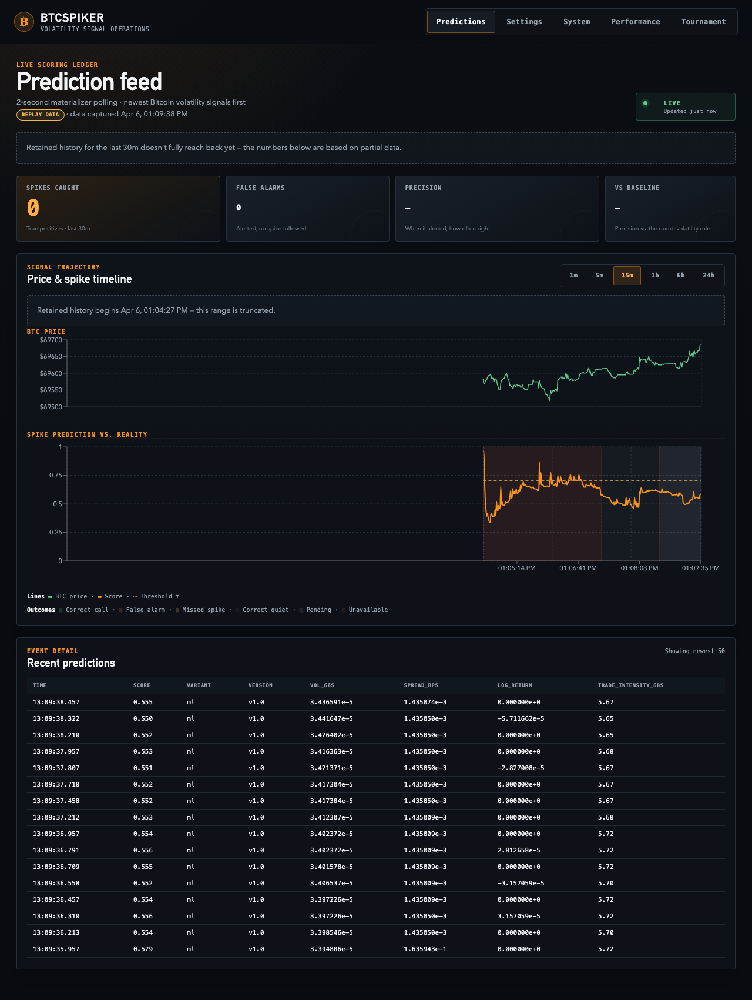
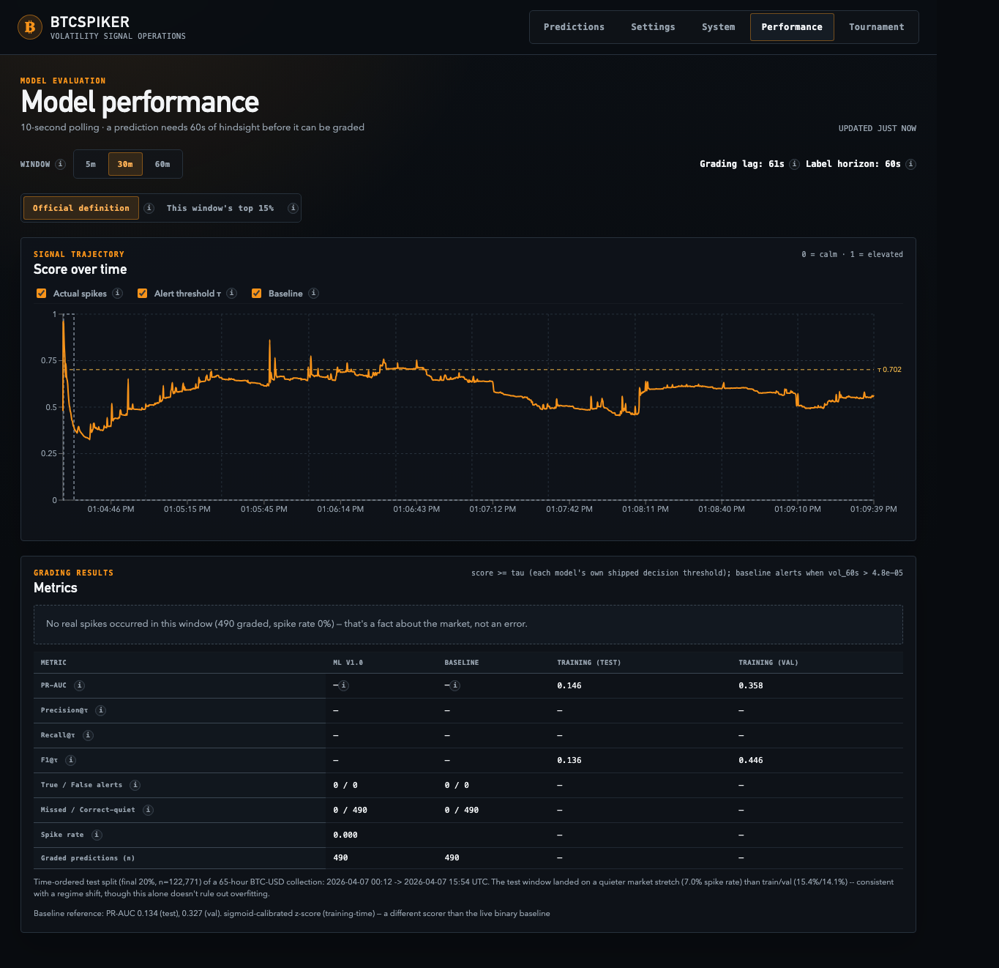
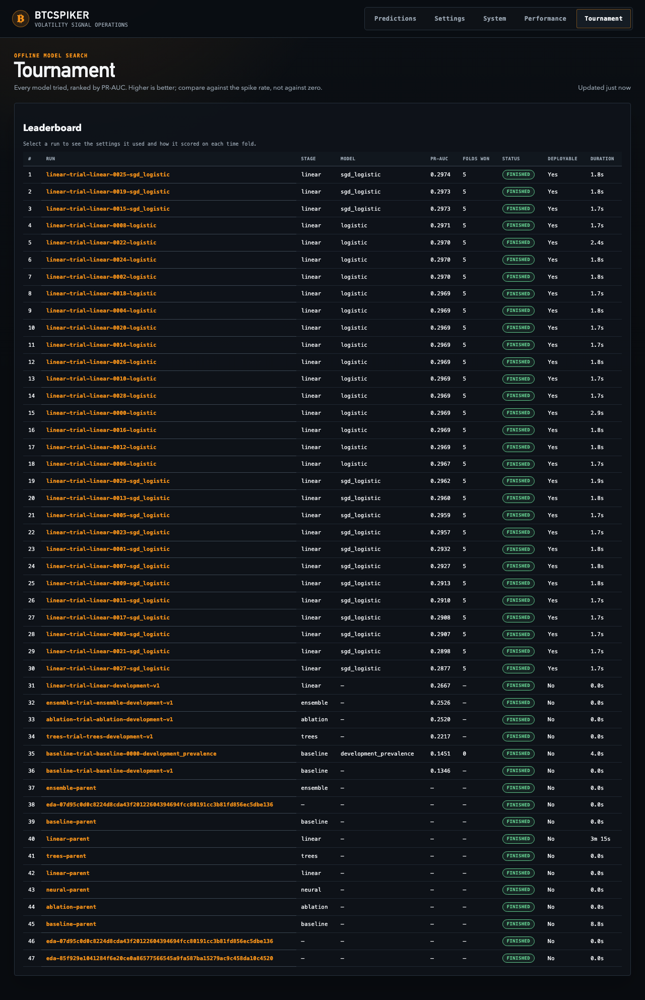

# BTCSpiker

**Real-time Bitcoin volatility-spike detection — streaming ML on live market data.**

BTCSpiker started as a school project and has since grown into a polished, production-ready service.

## Quick Start

```bash
cp .env.example .env
docker compose up -d --build
curl http://localhost:8000/health
curl http://localhost:8090/health
curl -X POST http://localhost:8000/predict -H "Content-Type: application/json" -d @handoff/data_sample/sample.json
```

Open the web UI at http://localhost:3001.

BTCSpiker is a real-time service that streams Coinbase style ticks into Kafka, generates rolling window features, and serves predictions via a FastAPI API. Prediction events are published to Kafka and projected into a SQLite read model for the web UI. The system runs end to end in replay mode with Prometheus and Grafana monitoring, and supports rollback using MODEL_VARIANT.

## Known issues (as of 2026-08-27)

The screenshots below are live captures from `docker compose up -d --build` on this
revision ([`d417cdb`](https://github.com/rrpichardo/BTCSpiker/commit/d417cdb8c57df686b16ac90114a5effa4ccdf462)),
not mockups. They're here because the problems they show have been reported and
"fixed" more than once without the fix holding, and that needs to be visible instead
of buried in commit history.

### Live grading keeps regressing to ~0% precision, and the fix hasn't held

| Date | What happened |
|---|---|
| 2026-08-10 | Root-caused as an **inverted model ranking** (live ROC-AUC 0.12 — worse than the 0.5 coin flip) via `scripts/diagnose_read_model.py`. Fixed in [`1bdac82`](https://github.com/rrpichardo/BTCSpiker/commit/1bdac82d9249f8b2572635d773c09cf6b293d2dc). |
| 2026-08-10 (later) | Verified working at accelerated 8x replay speed: 1,159 true positives, 63.6% recall, 46.3% precision. |
| 2026-08-11 | Regressed to **0/44 spike recall** at normal replay speed. Investigation opened, not closed by end of session. |
| 2026-08-27 (this capture) | Still broken. See below. |



*0 spikes caught, 0 false alarms, `–` precision — the model's score sits at 0.5–0.7
for the entire 15-minute window shown, hugging its own 0.702 decision threshold
without ever producing a graded outcome that resolves either way.*



*"No real spikes occurred in this window (490 graded, spike rate 0%) — that's a fact
about the market, not an error," per the tab's own disclosure. True/false alerts are
0/0 for both the model and the baseline. This is the honest failure mode — the tab
correctly refuses to compute precision/recall on zero positives — but it also means
**the live pipeline has not shown a single correctly-graded true positive in this
session**, and that has now been true across multiple independent runs, not just a
quiet 15-minute window.*

**This is not yet root-caused for the current session.** Do not read the 2026-08-10
fix as closing this — it closed one specific bug (inverted ranking), and a different
or recurring problem reintroduced the same symptom the very next day.

### The deployed benchmark and the best model ever found are two different models



- The **deployed** model's only documented benchmark (PR-AUC 0.1459 vs. 0.1340
  baseline) comes from a 65-hour capture from April — the same numbers the
  Performance tab still cites as "Training (test)" and "Training (val)" today.
- The **best model the tournament has ever found** — `linear-trial-linear-0025-sgd_logistic`,
  visible at the top of the leaderboard above — scored PR-AUC **0.2974** on 11 days of
  data. It was never promoted to Staging or Production. Nothing in this repo currently
  serves it.
- Neither number comes from a real held-out evaluation on enough data to trust: the
  11-day corpus is below the project's own 30-day qualification bar
  (`qualification_data=false`), and the deployed model's 65-hour capture is smaller
  still.
- A 35-day corpus that **does** clear the 30-day bar is already acquired
  (`rrpichardo/btcspiker-coinbase-history` on Hugging Face, coverage-verified), but as
  of this write-up it has not been materialized into features or run through the
  tournament. See [`PLAN.md`](PLAN.md) for the plan to close this.

### Net effect

Three different sessions have independently declared a fix for prediction quality
(PRs #6, #7, #8/#9) and the live tab has independently regressed to ~0% grading each
time. Until the 35-day corpus is materialized, tournamented, and the resulting
candidate is qualified through a real sealed holdout, **treat every PR-AUC number in
this repo as provisional** — including the ones in this README's own tables below.

## Canonical startup

### Environment

```bash
cp .env.example .env   # required: mounted read-only by the API settings view
docker compose up -d
# Wait ~30s for Kafka and MLflow init, then:
curl http://localhost:8000/health
curl http://localhost:8090/health
```

Use this root README together with the root `docker-compose.yaml` as the only startup guide for the project.

No manual model registration is required on a fresh clone — a one-shot
`mlflow-init` container logs the trained pipeline to MLflow. The prediction
quality tournament never promotes a candidate automatically: qualifying work
may register **Staging** only, while Production remains unchanged.
See [First-Time Setup in the runbook](docs/runbook.md#first-time-setup)
for the verification commands and notes on the shared `mlflow-data`
volume.

## Quick Test

The prediction API boundary is **post-featurization**: `/predict` accepts the seven engineered 60-second features produced by the featurizer, not raw Coinbase tick messages.

> **API schema note:** The `/predict` endpoint accepts the 7 engineered features the model was trained on (see [`handoff/docs/feature_spec.md`](handoff/docs/feature_spec.md)). This is a post-featurization boundary: the schema matches the trained model's features rather than raw tick fields.

```bash
curl -X POST http://localhost:8000/predict \
  -H 'Content-Type: application/json' \
  -d @handoff/data_sample/sample.json
```

The `sample.json` payload contains one feature row (row 1 of `handoff/data_sample/features_slice.csv`):

```json
{
  "rows": [{
    "log_return": 0.0,
    "spread_bps": 0.0014345986913609724,
    "vol_60s": 0.0,
    "mean_return_60s": 0.0,
    "trade_intensity_60s": 0.016666666666666666,
    "n_ticks_60s": 1,
    "spread_mean_60s": 0.010000000009313226,
    "ts": "2026-04-06T15:02:34.590029Z"
  }]
}
```

Expected response (`ts` is UTC wall-clock at inference time):

```json
{
  "scores": [0.10401],
  "model_variant": "ml",
  "version": "v1.0",
  "ts": "YYYY-MM-DDTHH:MM:SS.ffffffZ"
}
```

`/version` always returns the same metadata shape, with `stage` and `run_id` set to `null` when the API falls back to the local pickle artifact:

```json
{
  "model": "btc-volatility-lr",
  "version": "v1.0",
  "stage": "Production",
  "source": "mlflow",
  "run_id": "RUN_ID_OR_NULL",
  "sha": "GIT_SHA"
}
```

The system runs fully in replay mode by default, ensuring reproducibility without external dependencies.

## Data Ingestion Modes

The default `docker compose up -d` runs the replay ingestor, which loops a 10 minute Coinbase capture through Kafka at original timestamps. This ensures reproducibility without external dependencies.

To switch to live ingestion from Coinbase public WebSocket:

```bash
docker compose stop ingestor
docker compose --profile live up -d ws-ingestor
```

Both ingestion modes publish to the same `ticks.raw` Kafka topic, so only one should run at a time.

## Free historical BTC-USD research data

The historical pipeline acquires the reviewed 35-day Coinbase window for `$0`, validates at least 30 qualified day-equivalents, and stores normalized data in your private Hugging Face dataset. It does not start training or promote a model.

First authenticate locally; never paste the token into a command, config file, or chat:

```bash
hf auth login
hf auth whoami
```

Then run the pinned acquisition:

```bash
python scripts/download_coinbase_history.py \
  --cache-root data/coinbase_history/cache \
  --start 2026-04-24 \
  --end 2026-05-28 \
  --product BTC-USD \
  --revision c1e89eded9915e1c75a18911298edfbbbe4050ce \
  --max-rps 8
```

After a `PASS`, use the printed raw-manifest path to materialize the current seven-feature model input:

```bash
python scripts/materialize_coinbase_history.py \
  --raw-manifest data/coinbase_history/cache/manifests/<RAW_DATASET_ID>.json \
  --feature-set core_v1 \
  --output-root data/coinbase_history

export BTCSPIKER_EXISTING_DATA="$PWD/data/coinbase_history/features/core_v1/features.parquet"
python scripts/bind_existing_dataset.py --config experiment.yaml
```

The same raw manifest can also produce `multi_window_v1` and `microstructure_v1` for later model optimization. See [the source decision](docs/data/source-decision.md) for the frozen sources, privacy controls, quality gate, and research-only license boundary.

## Runtime Architecture

```text
Coinbase/replay → ticks.raw → featurizer → ticks.features (immediate) → predict-bridge
    → FastAPI /predict → ticks.predictions → materializer → SQLite read model
                                                       ↗            ↘ nginx UI on :3001
                          ticks.outcomes (60s delayed) ┘
```

Kafka is the source of truth for prediction events. The materializer owns a
disposable SQLite read model on the `predictions-data` volume and can rebuild it
by replaying `ticks.predictions` and `ticks.outcomes`. The UI uses same-origin
nginx routes: `/api/predictions/*` reaches the materializer and other `/api/*`
requests reach the FastAPI service.

The featurizer publishes each feature row to `ticks.features` **the instant its
tick arrives** — predictions are genuine online forecasts, not retrodictions.
The exact 60-second-forward label for that same row is computed separately and
published ~60 seconds later to `ticks.outcomes`, keyed by a stable `feature_id`.
The materializer joins predictions to outcomes on that ID and grades only rows
where the prediction's own scoring timestamp precedes the outcome being written
— proof the model called it before the answer existed. See the **Performance**
tab and `docs/runbook.md` for how this is exposed.

## Endpoints and Dashboards

| Service | URL | Notes |
|---|---|---|
| API | http://localhost:8000 | `/health`, `/predict`, `/version`, `/metrics` |
| Web UI | http://localhost:3001 | Predictions, Performance, read-only settings, and system status |
| Materializer | http://localhost:8090 | `/health`, `/predictions/recent`, `/predictions/performance` |
| MLflow | http://localhost:5001 | Training-run tracking |
| Prometheus | http://localhost:9090 | Scrapes API + kafka-exporter |
| Grafana | http://localhost:3000 | Anonymous viewer; dashboard "BTC Volatility Detector — API" |

## Rollback

To switch from the LR model to the deterministic baseline rule:

```bash
MODEL_VARIANT=baseline docker compose up -d api
curl -s http://localhost:8000/version | jq .source   # → "pickle"
```

Roll forward with `MODEL_VARIANT=ml docker compose up -d api`. The Grafana **Active variant** panel reflects the change within ~10 s.

## Repository Structure

```
api/             FastAPI prediction service (loads lr_pipeline.pkl)
features/        Featurizer Kafka consumer + rolling-window functions
materializer/    ticks.predictions + ticks.outcomes consumer, disposable SQLite
                 read model, and the Performance-tab grading endpoint
ui/              React web UI + nginx same-origin proxy
scripts/         Ingestors, prediction bridge, replay, and drift tooling
tests/           Smoke tests (test_api.py) + load test (load_test.py)
docker/          Dockerfile.api + Dockerfile.worker + requirements files
monitoring/      prometheus.yml + Grafana provisioning + dashboard JSON
docs/            Operational docs (see below)
handoff/         Model artifacts, data samples, and reference docs
docker-compose.yaml   Canonical compose stack
config.yaml           Featurizer config
```

## Documentation
| Doc | Purpose |
|---|---|
| [Known issues](#known-issues-as-of-2026-08-27) (this file) | Live-captured evidence that prediction-quality fixes have not held, and why every PR-AUC number here is provisional |
| [`docs/results.md`](docs/results.md) | Single-page scorecard: latency, success rate, PR-AUC vs baseline, rollback proof |
| [`docs/slo.md`](docs/slo.md) | Service Level Objectives + error budgets |
| [`docs/latency_report.md`](docs/latency_report.md) | Load-test methodology and percentiles |
| [`docs/drift_summary.md`](docs/drift_summary.md) | Evidently train-vs-test drift findings |
| [`docs/runbook.md`](docs/runbook.md) | Cold start, smoke test, rollback, common failures, recovery |
| [`docs/goals/prediction-quality-goal.md`](docs/goals/prediction-quality-goal.md) | Durable existing-data experiment charter and final-report contract |
| [`docs/Architecture Diagram.png`](docs/Architecture%20Diagram.png) | Canonical system architecture diagram |
| [`docs/architecture.svg`](docs/architecture.svg) | Earlier simplified diagram (optional reference) |
| [`docs/grafana_dashboard.png`](docs/grafana_dashboard.png) | Grafana dashboard screenshot |
| [`docs/selection_rationale.md`](docs/selection_rationale.md) | Why this architecture, API boundary, and model were chosen |
| [`handoff/docs/feature_spec.md`](handoff/docs/feature_spec.md) | Feature definitions and ablation notes |
| [`handoff/docs/model_card_v1.md`](handoff/docs/model_card_v1.md) | Model card |

## Notes on `handoff/`

The `handoff/` folder holds the packaged model artifacts, data samples, and reference docs (feature spec, model card). It is not the runtime entrypoint; use this root README and the root `docker-compose.yaml` to launch the system.

## CI

CI runs lint (Black/Ruff) plus a replay integration smoke test that brings up the full Docker Compose stack inside the GitHub Actions runner. Deeper monitoring validation (Grafana panels, Prometheus scrape correctness, Kafka-exporter lag) is verified locally rather than in CI.

Specifically, `.github/workflows/ci.yaml` runs two jobs on every push to `main` and on every pull request:

1. **`lint`** — runs `black --check` and `ruff check` across `api/` and `tests/`.
2. **`integration-replay`** — starts the Docker Compose stack, waits for the API and web UI, runs `pytest tests/test_replay_integration.py`, asserts the UI proxy returns a nonempty `/api/predictions/recent` response, and tears down. This is the smoke-level integration gate; comprehensive multi-scenario load testing is validated locally before merge.

The CI does not attempt to reproduce the full production monitoring stack validation (Grafana panels, Prometheus scrape correctness, Kafka-exporter lag) in the GitHub Actions runner — those are covered by the local smoke test documented in [docs/runbook.md](docs/runbook.md).
